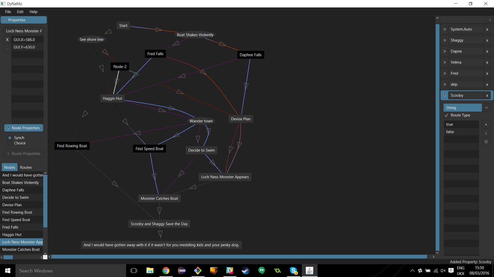

DyNaMo
======
*Dynamic Narrative Modelling*

<a href="https://travis-ci.org/echocam/dynamo">

</a>

DyNaMo is a set of tools to help game developers design and create
multinarrative stories, games where the player's descisions affect the outcome
of the story and change how a game plays out. This is alongside a runtime
library to let game engines hook into a designed story, so this system can
calculate's a player's state in the story for the engine. Example include a
bundled ['choose your own adventure'](examples) example featuring
Scooby-Doo\* and [DyNaDeMo](https://github.com/echocam/dynademo) a more
sophisticated 3D tech demo to show the flexibility of the tools.



Building, Running and Testing
=============================

You must have Java 1.8.0_74 or above installed. The project is built using
[Gradle](http://gradle.org/).

Linux/Unix/OS X
---------------

To run gradle tasks, open the root project directory in the terminal and do the
follwing:

Assemble and test the project:
```bash
./gradlew build
```

Assemble the project:
```bash
./gradlew assemble
```
To create assemble a jar file with all the dependencies:
```bash
./gradlew fatJar
```

To run the DyNaMo editor simply use the following:
```bash
./gradlew runEditor
```

To run the Scooby-Doo HTML example:
```bash
./gradlew runScoobyDooHTML
```

To run the Scooby-Doo Text example:
```bash
./gradlew runScoobyDooText
```

To run the Scooby-Doo HTML example, using explicit directory (can look at source
  to write your own):
```bash
./gradlew runHTMLPreview -Pdirectory="../../../examples/ScoobyDooHTML"
```

Similarly for text:
```bash
./gradlew runTextPreview -Pdirectory="../../../examples/ScoobyDooText"
```

To test:
```bash
./gradlew check
```

To clean:
```bash
./gradlew clean
```

Windows
-------
Windows is similar to Linux, but without the "./".


Specifying JDK path
-------------------
If you wish to specify the jdk path for gradle, add the following to a
gradle.properties file in the home directory.

```
org.gradle.java.home=/path/to/jdk1.8.0_72
```

Logging
-------
By default, every single debug message with a priority of 4 and above will be
logged. To customise how things are logged, create a config.json file in
src/main/java as follows:

```json
{
  "log": {
    "console": {
      "1" : [
        "all"  
      ],
      "2" : [
        "io"  
      ],
      "4" : [
        "gui"            
      ],
      "5" : [
        "error"
      ]
    }
  }
}
```

This example will log the following to the output console; everything of the
highest priority will be logged, everything related to I/O operations of level 2
and above (so levels 1 & 2) will be logged. Everything related to the GUI of
levels 4-1 will be logged and all errors will be logged.

To view all the available systems that can be logged, refer
to ```java uk.ac.cam.echo2016.multinarrative.dev.Debug```
for all constants starting with ```java SYSTEM_```.

Project Style Guide
===================

Java
----

### Indentation
Indentation must be done with 4 spaces. NOT tabs.

### Class Member Ordering
It is advised that class members are ordered as follows:
 - Fields
 - Constructors
 - Methods
Then the next level of subordering must be:
 - static members
 - instance members
Finally, within these catagories order things as follows:
 - public
 - protected
 - package
 - private

Refer to the following example:
```java
class TestClass {
    public static int publicStaticField = 0;
    protected static int protectedStaticField = 0;

    public int publicInstanceMember;
    private int privateInstanceMember;

    public TestClass() {
        privateInstanceMember = 0;
    }

    public static int publicStaticMethod() {
        return publicStaticField;
    }

    int packageInstanceMethod() {
        return privateInstanceMember;
    }
}
```
Abiding by this is up to the programmer's discretion, but don't diverge from
this format unless you have a good reason.

### Maximum Line Length
Lines must not be longer the 120 characters each.


Commits
-------
These are rough guidelines to how developers should commit to the repository.

### Messages

Git messages should have the following format:

```
Write imperatively, write less than 50 characters

The body should be separated from the title by a blank line like this.
Each line should be a maximum of 72 characters wide. You should explain
in detail WHY the changes you made were made, not necessarily WHAT has
changed. You don't need this though, just a title is ok as well!

Further paragraphs can appear after blank lines, and you can go into as
much depth as you want!

 - Woo bullet points!

 - Seriously, bullet points are a great way of listing information.

And that is how commit messages should be formatted, although this is a
rough guideline and by no means required as we are but humble student
developers.
```

© James Riordan, Angus Hammond, Elise Xue, Robin McFarland, Tim Ringland and
Tom Read Cutting.

\*SCOOBY-DOO and all related characters and elements are trademarks of and ©
Hanna-Barbera. WB SHIELD: TM & © WBEI. (s16) This piece of software is not
endorsed by or associated with the copyright and trademark holders of SCOOBY-DOO
in any way.
