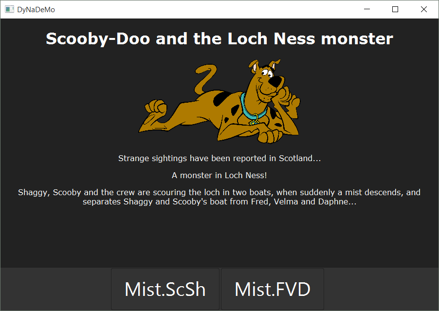

DyNaMo Examples
===============

This folder contains a couple of examples show of the basic text and HTML
previewer functionality of the engine. Feat Scooby-Doo\*.



To run the Scooby-Doo HTML example (from the root project folder of DyNaMo):
```bash
./gradlew runScoobyDooHTML
```

To run the Scooby-Doo Text example (from the root project folder of DyNaMo):
```bash
./gradlew runScoobyDooText
```

\*SCOOBY-DOO and all related characters and elements are trademarks of and ©
Hanna-Barbera. WB SHIELD: TM & © WBEI. (s16) This piece of software is not
endorsed by or associated with the copyright and trademark holders of SCOOBY-DOO
in any way.
